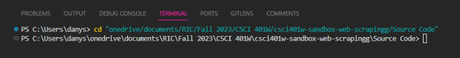
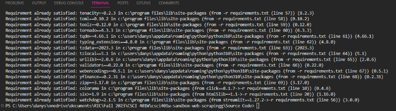
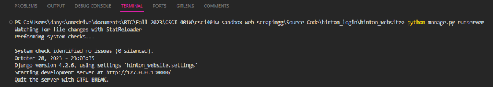
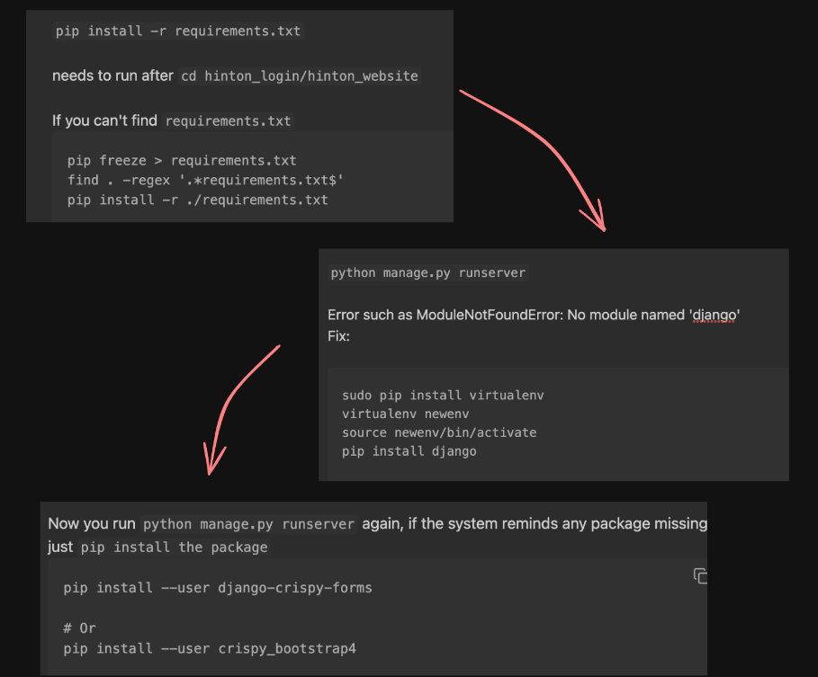

# Django Login How To
You may run into some obstacles but Google is always here to help us

## Navigate to the 'Source Code' Directory
This folder contains all of the necessary files to run the program

- For Windows: cd "/path/to/folder/named/Source Code"
- For MacOS: cd /path/to/your/source\ code

Example of my path:

## Install Required Libraries
In your terminal or command line, run the following command to install all the libraries needed for Django using the 
requirements.txt file:

- pip install -r requirements.txt

You should see something similar to this. Because my libraries are already installed, it shows that my requirements are already satisfied.

## Navigate to the Project Directory
After the installation is complete, locate the project’s directory where all of the application files are stored

- cd hinton_login/hinton_website

## Start the Django Server
- Once you are in the hinton_website folder,  start the Django development server by running the following command:

- python manage.py runserver

If you do not get an output like this, you may need to troubleshoot

## Access the Login Page
Once the server is up and running, open a web browser and go to the following URL:

- http://127.0.0.1:8000/login/

Or you can simply click on the link right in your terminal

## Troubleshooting Notes

